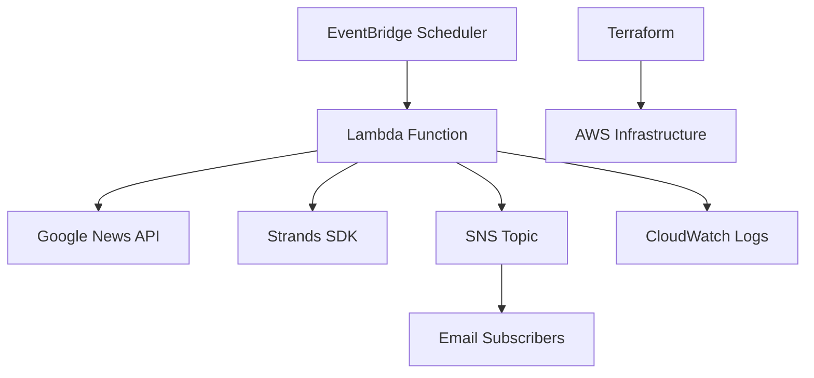

# Design Document

## Overview

The AI News Agent is a serverless Python solution built using the Strands SDK that automatically monitors Google News for Generative AI content, generates intelligent summaries, and distributes them via AWS SNS. The system leverages AWS Lambda with Python runtime for compute, EventBridge for scheduling, and follows CIS compliance standards with infrastructure deployed via Terraform.

## Architecture

The system follows a serverless event-driven architecture:



### Key Components:
- **AWS Lambda**: Serverless compute for the AI agent logic
- **Amazon EventBridge**: Scheduled triggers for regular execution
- **Amazon SNS**: Message distribution to subscribers
- **AWS CloudWatch**: Logging and monitoring
- **Terraform**: Infrastructure as Code deployment
- **Strands SDK**: AI agent framework and capabilities

## Components and Interfaces

### 1. News Fetcher Component
**Purpose**: Retrieve news articles from Google News API
**Interface**:
```python
from abc import ABC, abstractmethod
from typing import List
from datetime import datetime

class NewsFetcher(ABC):
    @abstractmethod
    async def fetch_news(self, query: str, time_range: str) -> List['NewsArticle']:
        pass

@dataclass
class NewsArticle:
    title: str
    content: str
    url: str
    published_at: datetime
    source: str
    relevance_score: Optional[float] = None
```

### 2. AI Summarizer Component
**Purpose**: Generate summaries using Strands SDK
**Interface**:
```python
from strands import Agent
from typing import List

class AISummarizer:
    def __init__(self, strands_agent: Agent, model_config: dict):
        self.agent = strands_agent
        self.model_config = model_config
    
    async def generate_summary(self, articles: List[NewsArticle]) -> 'NewsSummary':
        pass

@dataclass
class NewsSummary:
    summary: str
    key_points: List[str]
    sources: List[str]
    generated_at: datetime
    article_count: int
```

### 3. SNS Publisher Component
**Purpose**: Publish summaries to SNS topic
**Interface**:
```python
import boto3
from typing import Optional

class SNSPublisher:
    def __init__(self, sns_client: boto3.client, topic_arn: str):
        self.sns_client = sns_client
        self.topic_arn = topic_arn
    
    async def publish_summary(self, summary: NewsSummary) -> None:
        pass
```

### 4. Lambda Handler
**Purpose**: Orchestrate the entire workflow
**Interface**:
```python
from typing import Dict, Any

class LambdaHandler:
    def __init__(self, news_fetcher: NewsFetcher, 
                 ai_summarizer: AISummarizer, 
                 sns_publisher: SNSPublisher):
        self.news_fetcher = news_fetcher
        self.ai_summarizer = ai_summarizer
        self.sns_publisher = sns_publisher
    
    async def handler(self, event: Dict[str, Any], context: Any) -> Dict[str, Any]:
        pass
```

## Data Models

### NewsArticle Model
```python
from dataclasses import dataclass
from datetime import datetime
from typing import Optional
import uuid

@dataclass
class NewsArticle:
    title: str
    content: str
    url: str
    published_at: datetime
    source: str
    id: str = None
    relevance_score: Optional[float] = None
    
    def __post_init__(self):
        if self.id is None:
            self.id = str(uuid.uuid4())
```

### NewsSummary Model
```python
from dataclasses import dataclass
from datetime import datetime
from typing import List
import uuid

@dataclass
class ArticleSource:
    title: str
    url: str
    source: str
    published_at: datetime

@dataclass
class NewsSummary:
    summary: str
    key_points: List[str]
    sources: List[ArticleSource]
    generated_at: datetime
    article_count: int
    id: str = None
    
    def __post_init__(self):
        if self.id is None:
            self.id = str(uuid.uuid4())
```

### Configuration Model
```python
from dataclasses import dataclass
from typing import Literal
import os

@dataclass
class AgentConfig:
    search_query: str
    time_range_hours: int
    sns_topic_arn: str
    max_articles: int
    summary_length: Literal['short', 'medium', 'long']
    model_name: str
    model_provider: str
    
    @classmethod
    def from_environment(cls) -> 'AgentConfig':
        return cls(
            search_query=os.getenv('SEARCH_QUERY', 'Generative AI'),
            time_range_hours=int(os.getenv('TIME_RANGE_HOURS', '72')),
            sns_topic_arn=os.getenv('SNS_TOPIC_ARN'),
            max_articles=int(os.getenv('MAX_ARTICLES', '50')),
            summary_length=os.getenv('SUMMARY_LENGTH', 'medium'),
            model_name=os.getenv('MODEL_NAME', 'amazon.nova-pro-v1:0'),
            model_provider=os.getenv('MODEL_PROVIDER', 'bedrock')
        )
```

### AI Model Configuration
The Strands SDK agent will be configured to use Amazon Nova models through AWS Bedrock for news summarization. The recommended configuration includes:

- **Primary Model**: Amazon Nova Pro for high-quality summarization and reasoning
- **Alternative Models**: Amazon Nova Lite for cost-effective processing, Amazon Nova Micro for simple tasks
- **Model Access**: Via AWS Bedrock Runtime API using boto3
- **Model Selection**: Configurable via environment variables
- **Fallback Strategy**: If primary Nova model fails, fallback to Nova Lite
- **Cost Optimization**: Use Nova Lite for development/testing, Nova Pro for production
- **AWS Integration**: Native integration with AWS services for seamless authentication and logging

## Error Handling

### Error Categories and Responses:

1. **API Rate Limiting**
   - Implement exponential backoff
   - Log rate limit events
   - Continue with available data

2. **News API Failures**
   - Retry with different search terms
   - Fallback to cached recent articles if available
   - Send notification about service degradation

3. **Strands SDK Errors**
   - Implement fallback summarization logic
   - Log detailed error information
   - Attempt retry with simplified input

4. **SNS Publishing Failures**
   - Retry with exponential backoff
   - Log failed deliveries
   - Store summary for manual retry if needed

5. **Lambda Timeout/Memory Issues**
   - Implement chunked processing for large article sets
   - Monitor execution metrics
   - Adjust Lambda configuration based on usage patterns

### Error Logging Strategy:
- Structured logging with correlation IDs
- CloudWatch integration for monitoring
- Error metrics and alarms for critical failures

## Testing Strategy

### Unit Testing
- **News Fetcher**: Mock Google News API responses
- **AI Summarizer**: Test with sample article sets
- **SNS Publisher**: Mock SNS service calls
- **Lambda Handler**: Test orchestration logic

### Integration Testing
- **End-to-End Flow**: Test complete workflow with test SNS topic
- **API Integration**: Test actual Google News API calls with rate limiting
- **Strands SDK Integration**: Validate AI summarization quality

### Performance Testing
- **Lambda Cold Start**: Measure and optimize initialization time
- **Memory Usage**: Profile memory consumption with various article volumes
- **Execution Time**: Ensure completion within Lambda timeout limits

### Security Testing
- **IAM Permissions**: Validate least-privilege access
- **Data Encryption**: Verify encryption in transit and at rest
- **CIS Compliance**: Automated compliance checking

## Infrastructure Design

### AWS Services Architecture:

1. **Lambda Function**
   - Runtime: Python 3.11
   - Memory: 512MB (adjustable based on testing)
   - Timeout: 5 minutes
   - Environment variables for configuration
   - Strands SDK and dependencies packaged with function

2. **EventBridge Rule**
   - Schedule: Daily execution (configurable)
   - Target: Lambda function
   - Dead letter queue for failed invocations

3. **SNS Topic**
   - Email protocol subscriptions
   - Message filtering capabilities
   - Delivery status logging

4. **IAM Roles and Policies**
   - Lambda execution role with minimal permissions
   - SNS publish permissions
   - CloudWatch logging permissions

5. **CloudWatch**
   - Log groups for Lambda function
   - Custom metrics for monitoring
   - Alarms for error rates and execution failures

### CIS Compliance Considerations:
- Encryption at rest for all storage
- VPC endpoints for AWS service communication
- IAM policies following least privilege principle
- CloudTrail logging enabled
- Security groups with minimal required access

### Terraform Module Structure:
```
terraform/
├── modules/
│   ├── lambda/
│   ├── sns/
│   ├── eventbridge/
│   └── iam/
├── environments/
│   ├── dev/
│   └── prod/
└── main.tf
```

## Deployment Strategy

### Environment Promotion:
1. **Development**: Manual deployment for testing
2. **Production**: Automated deployment via CI/CD pipeline

### Configuration Management:
- Environment-specific variables via Terraform
- Secrets management using AWS Systems Manager Parameter Store
- Feature flags for gradual rollout

### Monitoring and Alerting:
- CloudWatch dashboards for system health
- SNS alerts for critical failures
- Cost monitoring and budgets